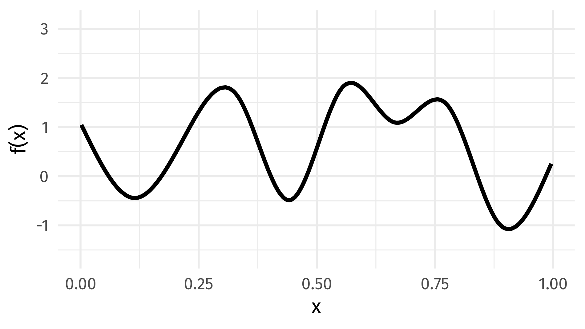
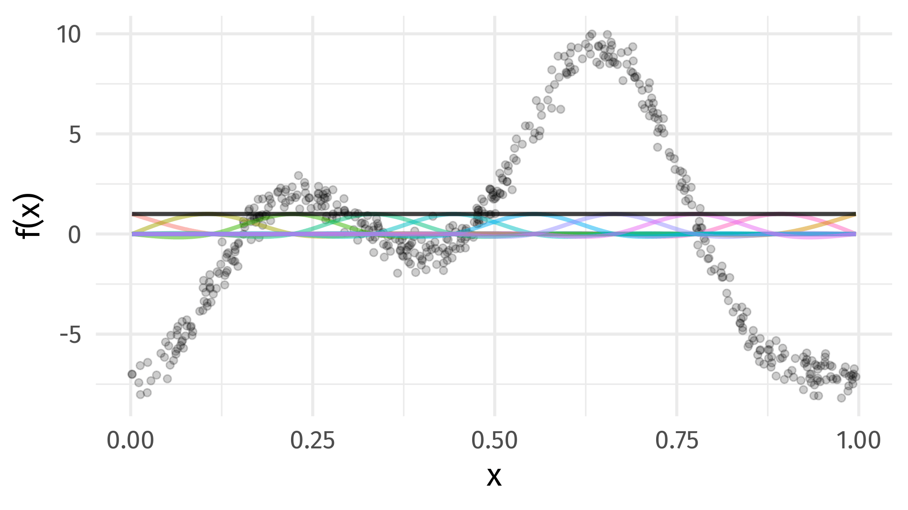
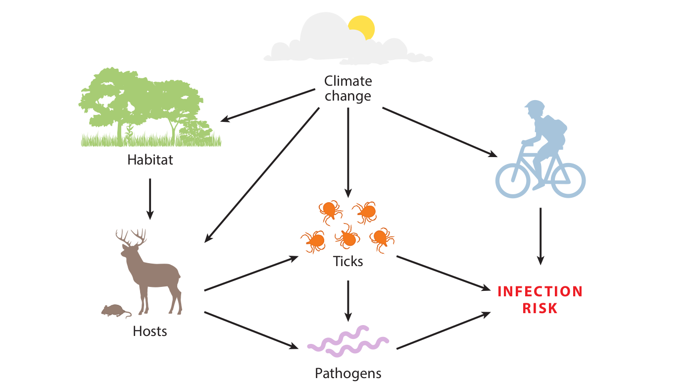

class: inverse middle center subsection

```{r setup, include=FALSE, cache=FALSE}
options(htmltools.dir.version = FALSE)
knitr::opts_chunk$set(cache = TRUE, dev = 'svg', echo = FALSE, message = FALSE, warning = FALSE,
                      fig.height=6, fig.width = 1.777777*6)

library("curl")
library("here")
library("tibble")
library("tidyr")
library("knitr")
library("viridis")
library("gganimate")
library("curl")
library("ggplot2")
library("dplyr")
library("tibble")
library("tidyr")
library("mgcv")
library("forcats")
library("mvnfast")
library("purrr")
library("gganimate")
library("gratia")
library("readr")
library("patchwork")
#theme_set(theme_minimal(base_size = 14, base_family = "Fira Sans"))

## plot defaults
theme_set(theme_minimal(base_size = 16, base_family = 'Fira Sans'))

## constats
anim_width <- 1900
anim_height <- anim_width / 1.77777777
anim_dev <- "png"
anim_res <- 300
```

# GAMs

---

# HadCRUT4 time series

```{r hadcrut-temp-example, echo = FALSE}
## Load Data
URL <-  "https://bit.ly/hadcrutv4"
gtemp <- read_table(URL, col_types = 'nnnnnnnnnnnn', col_names = FALSE) %>%
    select(num_range('X', 1:2)) %>% setNames(nm = c("Year", "Temperature"))

## Plot
gtemp_plt <- ggplot(gtemp, aes(x = Year, y = Temperature)) +
    geom_line() +
    geom_point() +
    labs(x = "Year", y = expression(Temperature ~ degree * C))
gtemp_plt
```

???

Hadley Centre NH temperature record ensemble

How would you model the trend in these data?

---

# Linear Models

$$y_i \sim \mathcal{N}(\mu_i, \sigma^2)$$

$$\mu_i = \beta_0 + \beta_1 \mathtt{year}_{i} + \beta_2 \mathtt{year}^2_{1i} + \cdots + \beta_j \mathtt{year}^j_{i}$$

---

# Polynomials perhaps&hellip;

```{r hadcrut-temp-polynomial, echo = FALSE}
p <- c(1,3,8,15)
N <- 300
newd <- with(gtemp, data.frame(Year = seq(min(Year), max(Year), length = N)))
polyFun <- function(i, data = data) {
    lm(Temperature ~ poly(Year, degree = i), data = data)
}
mods <- lapply(p, polyFun, data = gtemp)
pred <- vapply(mods, predict, numeric(N), newdata = newd)
colnames(pred) <- p
newd <- cbind(newd, pred)
polyDat <- gather(newd, Degree, Fitted, - Year)
polyDat <- mutate(polyDat, Degree = ordered(Degree, levels = p))
gtemp_plt + geom_line(data = polyDat, mapping = aes(x = Year, y = Fitted, colour = Degree),
                      size = 1.5, alpha = 0.9) +
    scale_color_brewer(name = "Degree", palette = "PuOr") +
    theme(legend.position = "right")
```

---

# Polynomials perhaps&hellip;

We can keep on adding ever more powers of $\boldsymbol{x}$ to the model &mdash;
model selection problem

**Runge phenomenon** &mdash; oscillations at the edges of an interval &mdash;
means simply moving to higher-order polynomials doesn't always improve accuracy

---
class: inverse middle center subsection

# GAMs offer a solution

---

# Generalized Additive Models

<br />


.references[Source: [GAMs in R by Noam Ross](https://noamross.github.io/gams-in-r-course/)]

???

GAMs are an intermediate-complexity model

* can learn from data without needing to be informed by the user
* remain interpretable because we can visualize the fitted features

---

# How is a GAM different?

$$\begin{align*}
y_i &\sim \mathcal{D}(\mu_i, \theta) \\ 
\mathbb{E}(y_i) &= \mu_i = g(\eta_i)^{-1}
\end{align*}$$

We model the mean of data as a sum of linear terms:

$$\eta_i = \beta_0 +\sum_j \color{red}{ \beta_j x_{ji}} +\epsilon_i$$

A GAM is a sum of _smooth functions_ or _smooths_

$$\eta_i = \beta_0 + \sum_j \color{red}{f_j(x_{ji})} + \epsilon_i$$

---

# Fitting a GAM in R

```r
model <- gam(y ~ s(x1) + s(x2) + te(x3, x4), # formuala describing model
             data = my_data_frame,           # your data
             method = "REML",                # or "ML"
             family = gaussian)              # or something more exotic
```

`s()` terms are smooths of one or more variables

`te()` terms are the smooth equivalent of *main effects + interactions*

$$\eta_i = \beta_0 + f(\mathtt{Year}_i)$$

```r
library(mgcv)
gam(Temperature ~ s(Year, k = 10), data = gtemp, method = 'REML')
```

---

# Fitted GAM

```{r hadcrtemp-plot-gam, echo = FALSE}
library('mgcv')
m <- gam(Temperature ~ s(Year), data = gtemp, method = 'REML')
N <- 300
newd <- as_tibble(with(gtemp, data.frame(Year = seq(min(Year), max(Year),
                                                    length = N))))
pred <- as_tibble(as.data.frame(predict(m, newdata = newd, se.fit = TRUE,
                                        unconditional = TRUE)))
pred <- bind_cols(newd, pred) %>%
    mutate(upr = fit + 2 * se.fit, lwr = fit - 2*se.fit)

ggplot(gtemp, aes(x = Year, y = Temperature)) +
    geom_point() +
    geom_ribbon(data = pred,
                mapping = aes(ymin = lwr, ymax = upr, x = Year), alpha = 0.4,
                inherit.aes = FALSE,
                fill = "steelblue") +
    geom_line(data = pred,
              mapping = aes(y = fit, x = Year),
              inherit.aes = FALSE, size = 1,
              colour = "steelblue") +
    labs(x = 'Year', y = expression(Temeprature ~ degree*C))
```

---

# How did `gam()` *know* what line to fit?

```{r hadcrtemp-plot-gam, echo = FALSE}
```

---

```{r smooth-fun-animation, results = FALSE, echo = FALSE}
f <- function(x) {
    x^11 * (10 * (1 - x))^6 + ((10 * (10 * x)^3) * (1 - x)^10)
}

draw_beta <- function(n, k, mu = 1, sigma = 1) {
    rmvn(n = n, mu = rep(mu, k), sigma = diag(rep(sigma, k)))
}

weight_basis <- function(bf, x, n = 1, k, ...) {
    beta <- draw_beta(n = n, k = k, ...)
    out <- sweep(bf, 2L, beta, '*')
    colnames(out) <- paste0('f', seq_along(beta))
    out <- as_tibble(out)
    out <- add_column(out, x = x)
    out <- pivot_longer(out, -x, names_to = 'bf', values_to = 'y')
    out
}

random_bases <- function(bf, x, draws = 10, k, ...) {
    out <- rerun(draws, weight_basis(bf, x = x, k = k, ...))
    out <- bind_rows(out)
    out <- add_column(out, draw = rep(seq_len(draws), each = length(x) * k),
                      .before = 1L)
    class(out) <- c("random_bases", class(out))
    out
}

plot.random_bases <- function(x, facet = FALSE) {
    plt <- ggplot(x, aes(x = x, y = y, colour = bf)) +
        geom_line(lwd = 1, alpha = 0.75) +
        guides(colour = "none")
    if (facet) {
        plt + facet_wrap(~ draw)
    }
    plt
}

normalize <- function(x) {
    rx <- range(x)
    z <- (x - rx[1]) / (rx[2] - rx[1])
    z
}

set.seed(1)
N <- 500
data <- tibble(x     = runif(N),
               ytrue = f(x),
               ycent = ytrue - mean(ytrue),
               yobs  = ycent + rnorm(N, sd = 0.5))

k <- 10
knots <- with(data, list(x = seq(min(x), max(x), length = k)))
sm <- smoothCon(s(x, k = k, bs = "cr"), data = data, knots = knots)[[1]]$X
colnames(sm) <- levs <- paste0("f", seq_len(k))
basis <- pivot_longer(cbind(sm, data), -(x:yobs), names_to = 'bf')
basis

set.seed(2)
bfuns <- random_bases(sm, data$x, draws = 20, k = k)

smooth <- bfuns %>%
    group_by(draw, x) %>%
    summarise(spline = sum(y)) %>%
    ungroup()

p1 <- ggplot(smooth) +
    geom_line(data = smooth, aes(x = x, y = spline), lwd = 1.5) +
    labs(y = 'f(x)', x = 'x') +
    theme_minimal(base_size = 16, base_family = 'Fira Sans')

smooth_funs <- animate(
    p1 + transition_states(draw, transition_length = 4, state_length = 2) + 
    ease_aes('cubic-in-out'),
    nframes = 200, height = anim_height, width = anim_width, res = anim_res,
    dev = anim_dev)

anim_save('resources/spline-anim.gif', smooth_funs)
```

# Wiggly things

.center[]

???

GAMs use splines to represent the non-linear relationships between covariates,
here `x`, and the response variable on the `y` axis.

---

# Basis expansions

In the polynomial models we used a polynomial basis expansion of $\boldsymbol{x}$

* $\boldsymbol{x}^0 = \boldsymbol{1}$ &mdash; the model constant term
* $\boldsymbol{x}^1 = \boldsymbol{x}$ &mdash; linear term
* $\boldsymbol{x}^2$
* $\boldsymbol{x}^3$
* &hellip;

---

# Splines

Splines are *functions* composed of simpler functions

Simpler functions are *basis functions* & the set of basis functions is a *basis*

When we model using splines, each basis function $b_k$ has a coefficient $\beta_k$

Resultant spline is a the sum of these weighted basis functions, evaluated at the values of $x$

$$f(x) = \sum_{k = 1}^K \beta_k b_k(x)$$

---

# Splines formed from basis functions

```{r basis-functions, fig.height=6, fig.width = 1.777777*6, echo = FALSE}
ggplot(basis,
       aes(x = x, y = value, colour = bf)) +
    geom_line(lwd = 2, alpha = 0.5) +
    guides(colour = "none") +
    labs(x = 'x', y = 'b(x)') +
    theme_minimal(base_size = 20, base_family = 'Fira Sans')
```

???

Splines are built up from basis functions

Here I'm showing a cubic regression spline basis with 10 knots/functions

We weight each basis function to get a spline. Here all the basisi functions have the same weight so they would fit a horizontal line

---

# Weight basis functions &#8680; spline

```{r basis-function-animation, results = 'hide', echo = FALSE}
bfun_plt <- plot(bfuns) +
    geom_line(data = smooth, aes(x = x, y = spline),
              inherit.aes = FALSE, lwd = 1.5) +
    labs(x = 'x', y = 'f(x)') +
    theme_minimal(base_size = 14, base_family = 'Fira Sans')

bfun_anim <- animate(
    bfun_plt + transition_states(draw, transition_length = 4, state_length = 2) + 
    ease_aes('cubic-in-out'),
    nframes = 200, height = anim_height, width = anim_width, res = anim_res, dev = anim_dev)

anim_save('resources/basis-fun-anim.gif', bfun_anim)
```

.center[]

???

But if we choose different weights we get more wiggly spline

Each of the splines I showed you earlier are all generated from the same basis functions but using different weights

---

# How do GAMs learn from data?

```{r example-data-figure, fig.height=6, fig.width = 1.777777*6, echo = FALSE}
data_plt <- ggplot(data, aes(x = x, y = ycent)) +
    geom_line(col = 'goldenrod', lwd = 2) +
    geom_point(aes(y = yobs), alpha = 0.2, size = 3) +
    labs(x = 'x', y = 'f(x)') +
    theme_minimal(base_size = 20, base_family = 'Fira Sans')
data_plt
```

???

How does this help us learn from data?

Here I'm showing a simulated data set, where the data are drawn from the orange functions, with noise. We want to learn the orange function from the data

---

# Maximise penalised log-likelihood &#8680; &beta;

```{r basis-functions-anim, results = "hide", echo = FALSE}
sm2 <- smoothCon(s(x, k = k, bs = "cr"), data = data, knots = knots)[[1]]$X
beta <- coef(lm(ycent ~ sm2 - 1, data = data))
wtbasis <- sweep(sm2, 2L, beta, FUN = "*")
colnames(wtbasis) <- colnames(sm2) <- paste0("F", seq_len(k))
## create stacked unweighted and weighted basis
basis <- as_tibble(rbind(sm2, wtbasis)) %>%
    add_column(x = rep(data$x, times = 2),
               type = rep(c('unweighted', 'weighted'), each = nrow(sm2)),
               .before = 1L)
##data <- cbind(data, fitted = rowSums(scbasis))
wtbasis <- as_tibble(rbind(sm2, wtbasis)) %>%
    add_column(x      = rep(data$x, times = 2),
               fitted = rowSums(.),
               type   = rep(c('unweighted', 'weighted'), each = nrow(sm2))) %>%
    pivot_longer(-(x:type), names_to = 'bf')
basis <- pivot_longer(basis, -(x:type), names_to = 'bf')

p3 <- ggplot(data, aes(x = x, y = ycent)) +
    geom_point(aes(y = yobs), alpha = 0.2) +
    geom_line(data = basis,
              mapping = aes(x = x, y = value, colour = bf),
              lwd = 1, alpha = 0.5) +
    geom_line(data = wtbasis,
              mapping = aes(x = x, y = fitted), lwd = 1, colour = 'black', alpha = 0.75) +
    guides(colour = "none") +
    labs(y = 'f(x)', x = 'x') +
    theme_minimal(base_size = 16, base_family = 'Fira Sans')

crs_fit <- animate(p3 + transition_states(type, transition_length = 4, state_length = 2) + 
                   ease_aes('cubic-in-out'),
                   nframes = 100, height = anim_height, width = anim_width, res = anim_res,
                   dev = anim_dev)

anim_save('./resources/gam-crs-animation.gif', crs_fit)
```

.center[]

???

Fitting a GAM involves finding the weights for the basis functions that produce a spline that fits the data best, subject to some constraints


---
class: inverse middle center subsection

# Avoid overfitting our sample

---
class: inverse center middle large-subsection

# How wiggly?

$$
\int_{\mathbb{R}} [f^{\prime\prime}]^2 dx = \boldsymbol{\beta}^{\mathsf{T}}\mathbf{S}\boldsymbol{\beta}
$$

---
class: inverse center middle large-subsection

# Penalised fit

$$
\mathcal{L}_p(\boldsymbol{\beta}) = \mathcal{L}(\boldsymbol{\beta}) - \frac{1}{2} \lambda\boldsymbol{\beta}^{\mathsf{T}}\mathbf{S}\boldsymbol{\beta}
$$

---

# Wiggliness

$$\int_{\mathbb{R}} [f^{\prime\prime}]^2 dx = \boldsymbol{\beta}^{\mathsf{T}}\mathbf{S}\boldsymbol{\beta} = \large{W}$$

(Wiggliness is the correct word and I'll die on that hill Reviewer 2)

We penalize wiggliness to avoid overfitting

---

# Making wiggliness matter

$W$ measures **wiggliness**

(log) likelihood measures closeness to the data

We use a **smoothing parameter** $\lambda$ to define the trade-off, to find
the spline coefficients $B_k$ that maximize the **penalized** log-likelihood

$$\mathcal{L}_p = \log(\text{Likelihood})  - \lambda W$$

---

# HadCRUT4 time series

```{r hadcrut-temp-penalty, echo = FALSE}
K <- 40
lambda <- c(10000, 1, 0.01, 0.00001)
N <- 300
newd <- with(gtemp, data.frame(Year = seq(min(Year), max(Year), length = N)))
fits <- lapply(lambda, function(lambda) gam(Temperature ~ s(Year, k = K, sp = lambda), data = gtemp))
pred <- vapply(fits, predict, numeric(N), newdata = newd)
op <- options(scipen = 100)
colnames(pred) <- lambda
newd <- cbind(newd, pred)
lambdaDat <- gather(newd, Lambda, Fitted, - Year)
lambdaDat <- transform(lambdaDat, Lambda = factor(paste("lambda ==", as.character(Lambda)),
                                                  levels = paste("lambda ==", as.character(lambda))))

gtemp_plt + geom_line(data = lambdaDat, mapping = aes(x = Year, y = Fitted, group = Lambda),
                      size = 1, colour = "#e66101") +
    facet_wrap( ~ Lambda, ncol = 2, labeller = label_parsed)
options(op)
```

---

# Picking the right wiggliness

.pull-left[
2 ways to think about how to optimize $\lambda$:

* Predictive: Minimize out-of-sample error
* Bayesian:  Put priors on our basis coefficients
]

.pull-right[
* **Practically**: use **REML**, because of numerical stability
* (Figure modified from Wood, 2011, J. R. Stat. Soc. B)
]

.center[

]

---

# Maximum allowed wiggliness

We set **basis complexity** or "size" $k$

This is _maximum wigglyness_, can be thought of as number of small functions that make up a curve

Once smoothing is applied, curves have fewer **effective degrees of freedom (EDF)**

EDF < $k$

---

# Maximum allowed wiggliness

$k$ must be *large enough*, the $\lambda$ penalty does the rest

*Large enough* &mdash; space of functions representable by the basis includes the true function or a close approximation to the tru function

Bigger $k$ increases computational cost

In **mgcv**, default $k$ values are arbitrary &mdash; after choosing the model terms, this is the key user choice

**Must be checked!** &mdash; `mgcv::k.check()`


---

# GAM summary

1. GAMs give us a framework to model flexible nonlinear relationships

2. Use little functions (**basis functions**) to make big functions (**smooths**)

3. Use a **penalty** to trade off wiggliness/generality 

4. Need to make sure your smooths are **wiggly enough**

---

Examples

---

# Vocal charades

.row[
.col-6[

Points here

]

.col-6[

```{r plot-dyads, echo = FALSE}
# load data
dyads <- read_csv(here("data/example2_dyads.csv")) |>
    janitor::clean_names() |>
    mutate(dyad = factor(dyad))

# plot raw data
dyads |>
  ggplot(aes(y = iconicity, x = t, group = dyad)) +
  geom_line(alpha = 0.6) +
  geom_smooth(aes(group = NULL), method = "loess", formula = y ~ x) +
  labs(y = "Iconicity", x = "Time") +
  theme_minimal(base_size = 24, base_family = 'Fira Sans')
```

]
]

???

Consider an experiment where participants play a game of ‘vocal charades’, as in the study of Perlman et al. (2015). At each round, a participant has to vocalize a meaning to the partner (e.g. ‘ugly’) without using language (e.g. through grunting or hissing). The partner has to guess the meaning of the vocalization. This game is played repeatedly with the finding that over time, a dyad converges on a set of nonlinguistic vocalizations that assure a high degree of intelligibility between the two participants in the dyad (Perlman et al. 2015). Initially, participants may be struggling with the task and explore very different kinds of vocalizations. Over time, they may converge on a more stable set of iconic vocalizations, that is vocalizations that resemble the intended referent (e.g. a high-pitched sound for ‘attractive’ and a low-pitched sound for ‘ugly’).

Finally, after even more time, the dyad may conventionalize to idiosyncratic patterns that deviate from iconicity and become increasingly arbitrary (cf. Garrod et al. 2007). This general pattern is shown with simulated data in Figure 3a, with iconicity first increasing, and then decreasing slightly, as signals become more and more arbitrary through conventionalization.5 Such an inverse U-shaped pattern can be modeled by incorporating polynomial fixed effects into the mixed-effects regression analysis. This approach is frequently called GCA in psychology (Mirman et al. 2008; Mirman 2014).

---

# Parametric model

$$
\mathtt{iconicity}_i = \alpha + \beta_1 t_i + \beta_2 t^2_i + \dots
$$

(Ignoring the dyads; random effects for $t$ & $t^2$ and $\alpha$)

---

# GAM approach

$$\mathtt{iconicity}_{i} = \alpha_{i(\mathtt{dyad})} + f_{i(\mathtt{dyad})}(\mathtt{t})$$

Where now I have included random effects and a "random smooth" for the $j$th dyad

---

# GAM approach

```{r dyad-model-1, echo = TRUE}
m_0 <- bam(iconicity ~ s(t, dyad, bs = "fs", k = 7),
  data = dyads, method = "fREML")
```

---

# GAM approach

```{r plot-dyad-model-1}
draw(m_0)
```

---

# HGAM approach

Using a lot of degrees of freedom (parameters) to model essentially the same _shape_

Instead, we can fit what Pedersen et al (2019) termed a Hierarchical GAM

```{r dyad-model-2, echo = TRUE}
m_1 <- bam(iconicity ~ s(t, k = 6) +
  s(t, dyad, bs = "fs", k = 6),
data = dyads, method = "fREML")
```

---

# HGAM approach

```{r plot-dyad-model-2}
draw(m_1)
```

---

# HGAM approach

The HGAM formulation uses many fewer degrees of freedom for effectively the same fit

```{r model-edf}
gratia::model_edf(m_0, m_1)
```

---

# Chess DB

---

---
class: inverse subsection center middle

# Lyme borreliosis

```{r lyme-borreliosis-setup, echo = FALSE, results = "hide", echo = FALSE}
# Analysis of the Lyme borreliosis weekly incidence data from Norway

# Data are from:
# The emergence and shift in seasonality of Lyme borreliosis in Northern Europe
# Goren et al (2023) doi.org/10.1098/rspb.2022.2420

# Packages
pkgs <- c("tibble", "readr", "dplyr", "here", "tidyr", "ggplot2", "mgcv",
    "gratia")
vapply(pkgs, library, FUN.VALUE = logical(1L), character.only = TRUE,
    logical.return = TRUE)

f <- here("data", "lyme-borreliosis.csv")

lyme <- read_csv(f,
    col_types = "-iiiiiiiiiii")

lyme <- lyme |>
    mutate(date = as.Date(paste(yrwk, "1"), format = "%Y%U%u"),
    fyear = factor(year),
    pop = pop / 100000) |>
    select(-yrwk)
```

---

# Lyme borreliosis

.row[

.col-9[
Lyme disease is a zoonotic infection

Caused by bacteria (spirochetes) in the *Borrelia burgdorferi* sensu lato complex

Transmitted by infected tick larvae & nymphs in the genus *Ixodes* during blood meals

Common vector-borne disease in N hemisphere

Reported cases of Lyme borreliosis have increased in recent decades
]

.col-3[

.center[
```{r insert-tick-img}
knitr::include_graphics("resources/Adult_deer_tick.jpg")
```
]

.smaller[Adult deer tick, *Ixodes scapularis*

(Source: Scott Bauer)
]

]

]
???

Increased in both number and geographical range

---

# Tick-borne disease & climate

.center[
```{r insert-tick-schematic, out.width = "90%"}

```
]

.smaller[source: Gilbert (2021) *Annu. Rev. Entomol.* [10.1146/annurev-ento-052720-094533](https://doi.org/10.1146/annurev-ento-052720-094533)
]

???

Figure caption from Gilbert (2021)

Schematic diagram showing how climate change can affect ticks directly (by changing oviposition, development, mortality rates, and activity) and indirectly (by changing habitat and host species and abundance). Climate change can, in turn, affect tick-borne pathogen infection risk in humans by directly affecting human behavior (e.g., outdoor recreation) and indirectly affecting pathogen transmission rates and prevalence via hosts and ticks. The relative importance of each pathway is challenging to ascertain.


---

# Tick-borne disease & climate

Aim of Goren *et al* (2023) was to study

1. the incidence, and

2. the seasonal timing

of Lyme borreliosis at the northern limit of the range in Europe

---

# Cases of Lyme borreliosis in Norway

```{r lyme-cases-plot, echo = FALSE, out.width = "95%", fig.align = "center"}
lyme |>
    ggplot(aes(x = week, y = cases, group = year, colour = year)) +
    geom_line(linewidth = 0.75)  +
    scale_color_viridis_c(option = "magma",
        guide = guide_colourbar(barheight = unit(0.5, "npc"))) +
    theme_grey(base_size = 18) +
    labs(x = "Week", y = "Number of cases per week", colour = NULL)
```
.small[
Data: Goren *et al* (2023) *Proc. Biol. Sci.* [10.1098/rspb.2022.2420](https://doi.org/10.1098/rspb.2022.2420)
]

---

# Climate change in Norway

Compared to 1979&ndash;2008 reference period

Annual mean temperature increased by ~ 0.5&#8451;

Winter temperatures increase by ~1&#8451;

Growing season increased by 1&ndash;2 weeks nationally

Annual precipitation increased by ~3% per decade

---

# GAM for seasonal data

Assume weekly cases are distributed Negative binomial

$$
\texttt{cases}_i \sim \mathcal{NB}(\mu_i, \theta)
$$

Lots of ways to decompose these data; settled on

.small[
$$
\log (\mathbb{E}(\texttt{cases}_i) ) = \beta_0 + f(\texttt{week}_i , \texttt{year}_i) + \log(\texttt{population}_i)
$$
]

where

$$
f(\texttt{week}_i , \texttt{year}_i)
$$

is a tensor product smooth (main effects plus interaction)

---

# GAM for seasonal data

Model code looks like:

```{r lyme-gam-code, echo = TRUE, cache = TRUE}
m <- bam(cases ~ s(week, bs = "cc", k = 20) +
                 s(year, k = 25) +
                 ti(week, year, bs = c("cc", "tp"), k = c(20, 20)) +
                 offset(log(pop)),
    data = lyme,
    family = nb(),
    method = "fREML",
    knots = list(week = c(0.5, 52.5)),
    discrete = TRUE,
    nthreads = 4)
```

Using lots of *mgcv* tricks to fit the model *fast* as some decompositions take a long time to fit with `gam()`

Decomposed tensor product into main smooth effects plus a pure smooth interaction

---

# Estimated smooth functions

```{r lyme-draw, cache = TRUE, out.width = "95%", fig.align = "center"}
draw(m, rug = FALSE) + plot_layout(ncol = 2) & theme_grey(base_size = 14)
```

---

# Estimated seasonal curves

```{r lyme-plot-fitted-curves, cache = TRUE, out.width = "95%", fig.align = "center"}
# predict to find week of peak in each year
ds <- data_slice(m, week = evenly(week, n = 100), year = unique(year),
    pop = log(100000))

fv <- fitted_values(m, data = ds, scale = "response")

fv |>
    ggplot(aes(x = week, y = fitted, group = year, colour = year)) +
    geom_line(linewidth = 1) +
    scale_colour_viridis_c(option = "magma",
        guide = guide_colourbar(barheight = unit(0.5, "npc"))) +
    labs(y = "Number of cases per 100,000 population", x = "Week",
        title = "Annual seasonal trend in cases of Lyme borreliosis",
        colour = NULL) +
    theme_grey(base_size = 18)
```

---

# How has timing of peak changed?

Easy &mdash; using data in previous figure, find week in each year where $\widehat{\texttt{cases}}_{ij}$ is maximal

--

Harder &mdash; account for the uncertainty in the model & put an uncertainty band on $\widehat{\texttt{peak}}_{ij}$

--

GAMs are an *empirical Bayesian* model so we can simulate from the posterior distribution of the model to get answers to questions like this

---

# How has timing of peak changed?

*gratia* 📦 has functions to make doing this easy(-ish)

```{r lyme-posterior-simulation, cache = TRUE, echo = TRUE}
ds2 <- data_slice(m, week = unique(week), year = unique(year), pop = log(100000))

ds2 <- ds2 |>
    add_column(row = seq_len(nrow(ds2)), .before = 1L)

fs2 <- fitted_samples(m, data = ds2, n = 10000, seed = 42, scale = "response")

fs2 <- fs2 |>
    left_join(ds2, by = join_by(row)) |>
    select(-pop)

peak_week <- fs2 |>
    group_by(year, draw) |>
    slice_max(order_by = fitted, n = 1) |>
    group_by(year) |>
    summarise(peak = quantile(week, prob = 0.5),
        lower_ci = quantile(week, prob = 0.055),
        upper_ci = quantile(week, prob = 0.945))
```

---

# How has timing of peak changed?

```{r lyme-plot-peak-week, cache = TRUE, out.width = "95%", fig.align = "center", dependson = -1}
peak_week |>
    ggplot(aes(x = year, y = peak)) +
    geom_pointrange(aes(ymin = lower_ci, ymax = upper_ci)) +
    labs(y = "Week of peak cases", x = NULL,
        caption = "(89% credible interval)") +
    theme_grey(base_size = 18)
```

---

# Summary

GAMs offer a flexible way to model (decompose) temporal variation in ecological time series

Can be adapted in many ways

* space
* space & time
* covariate effects
* model distributions or quantiles
* handle very large data

Posterior inference allows us to do many useful things (easily &mdash, more easily)

---

# Slides

* &copy; Simpson (2022-2023) [](http://creativecommons.org/licenses/by/4.0/)

* HTML Slide deck [gavinsimpson.github.io/princeton-2023/](https://gavinsimpson.github.io/princeton-2023/)

* RMarkdown [https://github.com/gavinsimpson/princeton-2023](https://github.com/gavinsimpson/princeton-2023)

* DOI: 10.5281/zenodo.7706659 [](https://zenodo.org/badge/latestdoi/610948193)

* @ucfagls on Twitter
